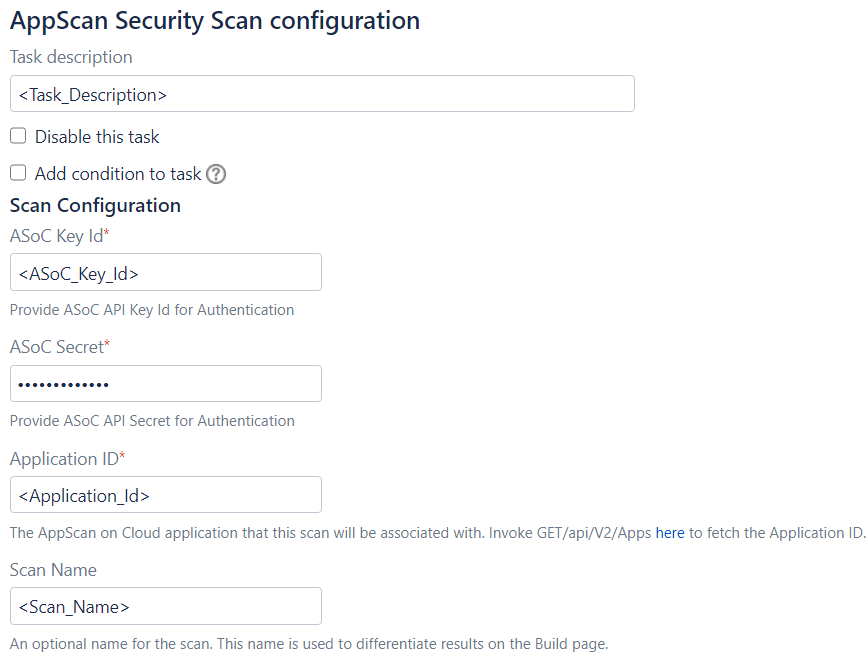
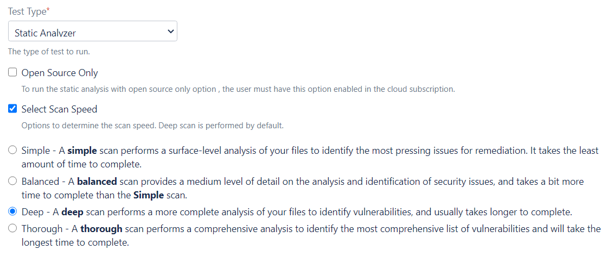
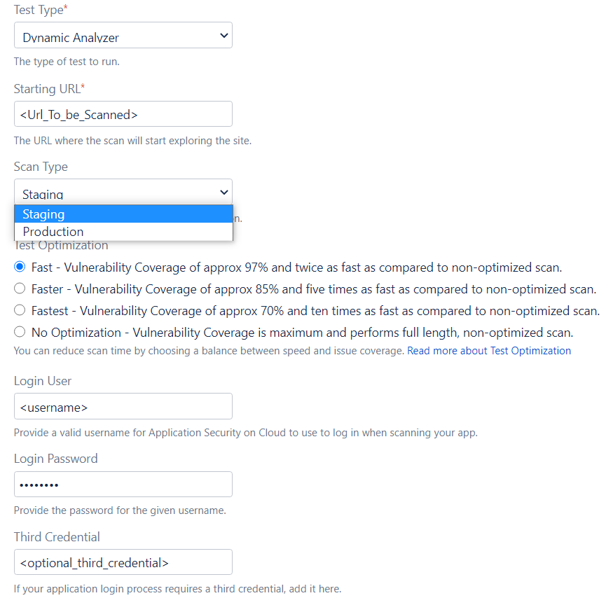
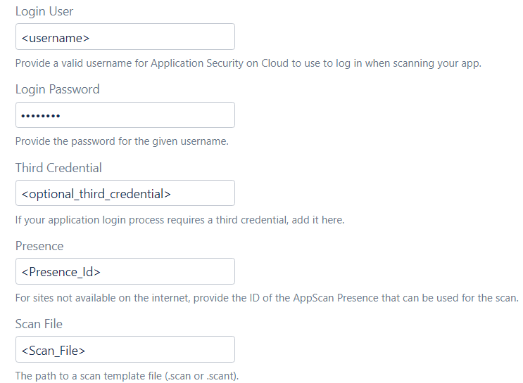
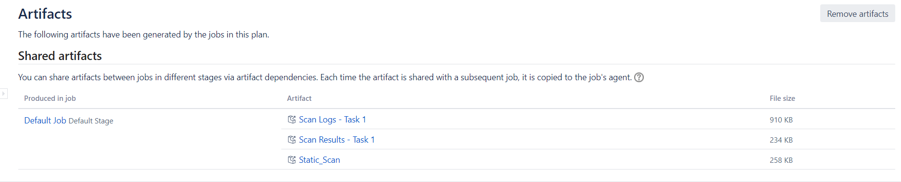
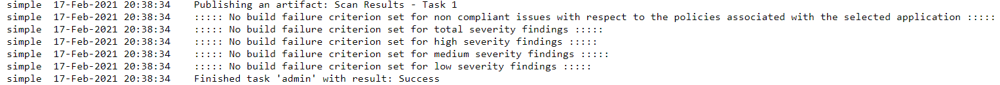

# HCL AppScan on Cloud Bamboo Plug-in

Easily integrates security scanning into your Atlassian Bamboo builds. This plug-in enables you to execute SAST (Static Application Security Testing) and DAST (Dynamic Application Security Testing) scans using [HCL AppScan on Cloud](https://cloud.appscan.com/) on local and remote agents as configured on your Bamboo server.

# Pre-requisites

- An account on the [HCL AppScan on Cloud](https://cloud.appscan.com/) service. Make a note of [API Key ID and Secret Key](https://help.hcltechsw.com/appscan/ASoC/appseccloud_generate_api_key_cm.html) of your HCL AppScan on Cloud account. This will be required later when configuring the scan task.
- You'll also need to [create an application](https://help.hcltechsw.com/appscan/ASoC/ent_create_application.html) on the service. Make note of your application's numeric ID in the browser URL. This ID will be required later when configuring the scan task.
- The plug-in has been tested to run on Bamboo server version: 6.8.0 or later.
- To build the plug-in, you will need to install the [Atlassian plug-in SDK](https://developer.atlassian.com/docs/getting-started). The plugin uploaded to Bamboo marketplace has been built with SDK version: 8.0.16

# Building the Plug-in

- Navigate to the plug-in's root folder and issue the `atlas-package` command. The built plug-in JAR will be in the target folder.

# Installation

   Installation can be achieved via two ways:
   
   - Install the built plug-in jar using "Upload app" option, via the Manage Apps section of Bamboo administration dashboard.
   - Install the plugin published to Atlassian Marketplace (recommended) via "Find new apps" link in the Manage Apps section of Bamboo administration dashboard.
  

# Configuring the AppScan Security Scan task for your Build Plan

1. Add the AppScan Security Scan task to your build plan after your artifacts have been built. 
    
    

2. Enter the following generic information to configure the scan:
    
    
    
    - **Task Description**: Specify a task description
    
    - **ASoC Key Id and Secret**: Specify the ASoC Key id and secret.
    
    - **Application ID**: Specify the application ID to associate your scan with.
    
    - **Scan Name**: Specify a name to use for the scan. This value will be used to distinguish this scan and its results from others.

3. Configuring parameters for the SAST scan:
    
    
    
    - **Test Type**: For static scan, select Test type as "Static Analyzer". Once selected, below options will be displayed:
    
    - **Open Source Only**: Select Open Source Only option to look only for known vulnerabilities in open source packages.
    
    - **Select Scan Speed**: Select this option to specify a Scan optimization level based on need and time demands:
    
      - **Simple**: A simple scan performs a surface-level analysis of your files to identify the most pressing issues for remediation. It takes the least amount of time to complete.
      
      - **Balanced**: A balanced scan provides a medium level of detail on the analysis and identification of security issues, and takes a bit more time to complete than the simple scan.
      
      - **Deep**: Default. A deep scan performs a more complete analysis of your files to identify vulnerabilities, and usually takes longer to complete.
      
      - **Thorough**: A thorough scan performs a comprehensive analysis to identify the most comprehensive list of vulnerabilities and will take the longest time to complete.
      
      Note: Scan speed does not necessarily correlate to relative number of vulnerabilities found in the code. For example, thorough analysis may rule out false positives that might be reported in a simple scan and therefore report fewer vulnerabilities.

4. Configuring parameters for the DAST scan:
    
        
    
    - **Test Type**: For dynamic scan, select Test type as "Dynamic Analyzer". Once selected, below options will be displayed:
    
    - **Starting URL** - Specify the Starting URL from where you want the scan to start exploring the site.
    
    - **Scan Type** - Specify whether your site is a Staging site (under development) or a Production site (live and in use).
    
    - **Test Optimization**: Following options are available:
      
      - **Fast**: Default. Select this option for approximately 97% issue coverage and twice as fast test stage speed. Recommended for security experts for more frequent scans.
      
      - **Faster**: Select this option for approximately 85% issue coverage and five times as fast test stage speed. Recommended for DevSecOps during ongoing evaluation.
      
      - **Fastest**: Select this option for approximately 70% issue coverage and ten times as fast test stage speed. Recommended for Dev and QA during initial evaluation.
      
      - **No Optimization**: Select this option for maximum issue coverage and longest scan. Recommended for security experts before major releases, compliance testing and benchmarks.
    
      
    
    - **Login User and Login Password**: If your app requires login, enter valid user credentials so that Application Security on Cloud can log in to the site.
    
    - **Extra Field**: If your app requires a third credential, enter it in this field.
    
    - **Presence**: If your app is not on the internet, select your AppScan Presence from the list. Information about creating an AppScan Presence is available [here](https://help.hcltechsw.com/appscan/ASoC/asp_scanning.html).
    
    - **Scan File**: If you have an AppScan Standard scan file, enter its full path and file name in this field. To learn more about AppScan Standard scan files, see [this topic](https://help.hcltechsw.com/appscan/ASoC/asd_AppScanStandard.html).

 5. **Email Notification**: Select this checkbox to receive an email when the security analysis is complete. The email will be sent to the email address associated with the selected credentials. 

 6. **Suspend job until security analysis completes**: If selected, the task will pause until security analysis has completed and the results have been retrieved from the service. If unselected, the job will continue once the scan has been submitted to the analysis service.

 7. **Configure Build Failure Criteria**: Select this checkbox to specify conditions that will cause the build to fail based on results of the security test.
      
      - **Fail build for non-compliance with application policies**: Select this option to fail the build if any security issues are found that are out of compliance with the policies of the selected application.
      
      - **Fail build if one of the following conditions apply**: Select this option to fail the build based on the specified number of non-compliant Total security issues, High severity security issues, Medium severity security issues, or Low severity security issues. If multiple thresholds are specified, they are logically OR'd together.

# Post Build Scan Artifacts

1. The AppScan Security scan task publishes the following artifacts:
   
   - Scan Results - HTML report of the security vulnerabilties that are found (only if waiting for the scan to complete option is selected) .
   
     

2. Messages about the outcome of each of the scan will also be written to the build log:
   
   

# License

All files found in this project are licensed under [Apache License 2.0](LICENSE).
